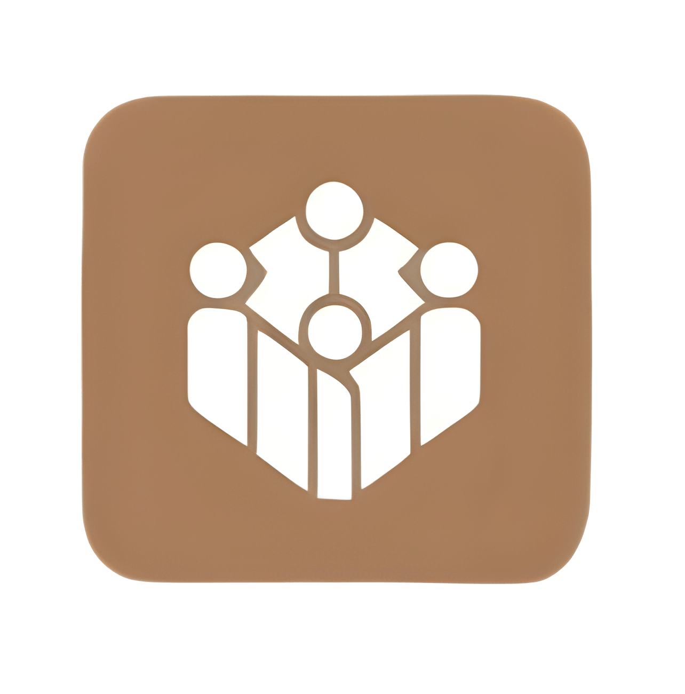
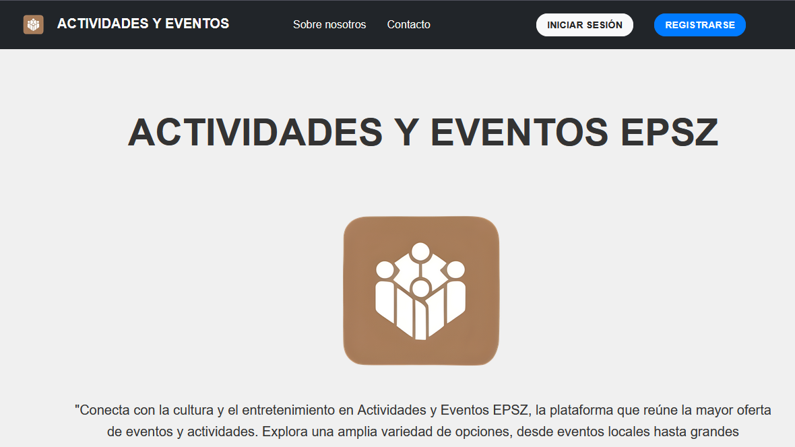

<meta charset="utf-8">
# daw2_2021-22_yii2_basic

<h1 align="center">Actividades y eventos EPSZ</h1>
<p align="center">
  
</p>
<p align="center">
  <a href="https://poliz.usal.es" target="_blank">
    
  </a>
  </a>
  <a href="https://github.com/yiisoft" target="_blank">
    
  </a>
  <h1 align="center">EPSZ-DAW2 - Yii2_basic</h1>
  <br>
  
</p>


ESTRUCTURA DE DIRECTORIOS
-------------------------

``` textplain
./               directorio base
  /codigo        contiene el código tu proyecto que empieza con la plantilla adaptada de la aplicación básica de Yii2.
  /librerias     contiene las librerías del framework y otras extensiones necesarias para su funcionamiento.
  /proyecto      contiene la descripción de tu proyecto de trabajo. Cópialo aquí si no lo tienes aún.
  /sql           contiene los scripts de la base de datos que se vayan necesitando y ampliando.

```
* NOTA: La carpeta "librerias" no se encuentra en el repositorio, puede descargarse desde el enlace [aquí](http://static.angeloeyama.es/librerias.zip). Una vez descargado, descomprímelo y coloca la carpeta en la raíz del proyecto.

## Instalación

Lo primero que debes hacer es clonar el repositorio en tu máquina local. Para ello, abre una terminal y ejecuta el siguiente comando:

```bash
git clone https://github.com/EPSZ-DAW2/daw2-2024-25_A_actividades_y_eventos.git
```

Una vez clonado el repositorio, accede al directorio `daw2-2024-25_A_actividades_y_eventos` y en la carpeta sql encontrarás el script de la base de datos que debes ejecutar en tu servidor de base de datos.

* Si estás utilizando Windows, puedes utilizar XAMPP, que incluye Apache, MySQL y PHP. Puedes descargarlo desde [aquí](https://www.apachefriends.org/es/index.html).

* Si estás utilizando Linux, puedes instalar Apache, MySQL y PHP por separado. Para ello, puedes seguir los siguientes pasos:

```bash
  sudo apt update
  sudo apt install apache2
  sudo apt install mysql-server
  sudo apt install php libapache2-mod-php php-mysql
```

Cuando tengas importada la base de datos, activa el servidor de Apache y MySQL y accede a la URL `http://localhost/daw2-2024-25_A_actividades_y_eventos/codigo/web/` para acceder a la aplicación.

* Nota: Si has clonado el repositorio en un directorio diferente, cambia `daw2-2024-25_A_actividades_y_eventos` por el nombre del directorio en el que hayas clonado el repositorio.

## Llamadas a la API de la aplicacion

Para más detalles sobre las llamadas a la API, consulta el archivo [API.md](API.md).


## Aplicación
Si todo ha ido bien, deberías ver la siguiente pantalla:



En esta pantalla, puedes registrarte como nuevo usuario o iniciar sesión si ya tienes una cuenta.
Los datos de prueba para iniciar sesión son los siguientes:

| Nombre de Usuario | Contraseña     | Rol                |
|-------------------|----------------|--------------------|
| user1             | password123    | Sysadmin           |
| user2             | password123    | Administrador      |
| user3             | password123    | Patrocinador       |
| user4             | password123    | Moderador          |
| user5             | password123    | Usuario Registrado |
| user6             | password123    | Usuario Registrado |
| user7             | password123    | Usuario Registrado |

## Autores
Este proyecto ha sido desarrollado por el grupo A de la asignatura DAW2 del curso 2024-2025 de la EPSZ.

## Sobre la plantilla
Esta plantilla es la estructura base para los trabajos en grupo de la asignatura DAW2.

La plantilla está basada en la aplicación &quot;yii2-app-basic&quot; de Yii2, 
descargada en fecha 2024-12-02, que contiene numerosas extensiones de código libre,
en concreto se incluye el uso de estilos y componentes de &quot;Bootstrap 5&quot;
y la extensión &quot;JUI&quot; para el uso de los componentes de &quot;jQuery User Interface&quot;.

Está adaptada también con la configuración de conexión de base de datos separada
en función del proyecto de trabajo en grupo que debas realizar y con la plantilla 
base para un modelo "Usuario" que deba implementar el acceso a la aplicación.
